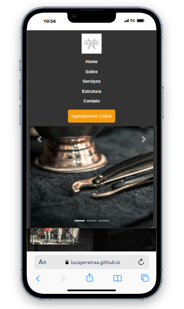

# Projeto Final Front-End Barbearia

## Descrição do Projeto
O intuito deste repositorio e projeto é mostrar as técnicas e codigos ultilizados para a sua criação

## Paleta de Cores
A paleta de cores foi escolhida para oferecer uma boa experiência visual e garantir acessibilidade. As cores principais são:

- **Cor Primária:** #333 (Cinza)
- **Cor de Destaque:** #f39c12(Amarelo)
- **Cor de Fundo:** #333333 (Cinza Claro)
- **Texto Principal:** #f9f9f9 (Branco)
- **Botão enviar:** #0069d9 (azul claro)

## Tipografia
A tipografia do projeto foi escolhida para garantir clareza e legibilidade:

- **Fonte Primária:** 'Franklin Gothic Medium', 'Arial Narrow', Arial, sans-serif;

Essas fontes foram escolhidas por sua legibilidade e boa adaptação em diversos dispositivos e tamanhos de tela.

## Lista de Tarefas do Projeto
Aqui estão as tarefas realizadas e as pendentes do projeto:

- [x] Configuração do ambiente de desenvolvimento
- [x] Criação do layout da página inicial
- [x] Criação do layout de perguntas
- [ ] Testes de responsividade
- [x] Implementação de funcionalidades de feedback do usuário
- [x] layout da página final

    
    

    

## Informações de Contato
Se você tiver dúvidas ou quiser mais informações sobre o projeto, entre em contato com:

- **Nome:** [Lucapereiraa]
- **E-mail:** [lucapereiraa20@gmail.com]
- **Instagram:** [https://www.instagram.com/lucas_ampe/?next=%2F]
- **GitHub:** [https://github.com/lucapereiraa]

## Link de Acesso ao Site
Você pode acessar o site clicando no link abaixo:

[Visite o site](https://github.com/lucapereiraa/Barbearia)

## Tecnologias Utilizadas

O projeto foi desenvolvido utilizando as seguintes tecnologias:

- **Html** -
- **CSS** -
- **Node.js** - Ambiente de execução JavaScript (https://nodejs.org/)
- **Bootstrap** - Framework CSS para design responsivo (https://getbootstrap.com/)

